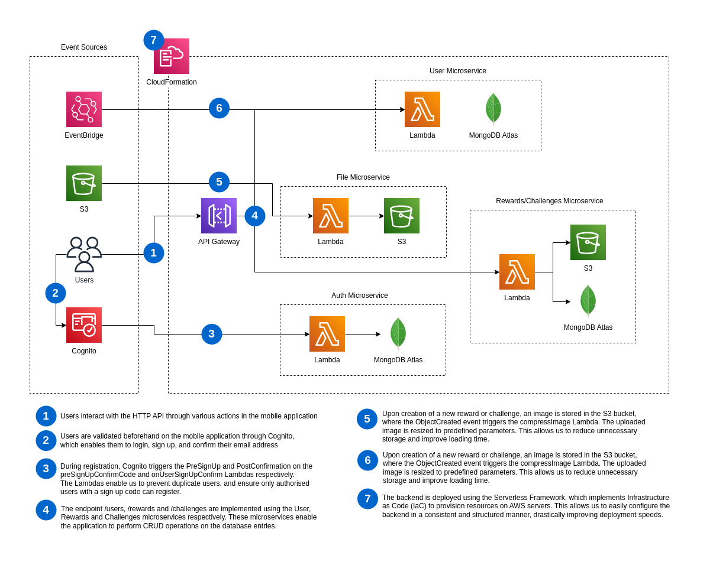

<!-- omit in toc -->
# Officeverse Backend

<!-- omit in toc -->
## Table of Contents
- [Architecture](#architecture)
- [Development](#development)
  - [Setup](#setup)
  - [Development](#development-1)
  - [Deployment](#deployment)

## Architecture

Our backend adopts a event-driven architecture, and uses the Serverless Framework to provision resources with EventBridge Infrastructure as Code.



## Development

### Setup

The following are pre-requisites for setting up the development environment:

- Node 18.x and above
- [Serverless Framework CLI](https://www.serverless.com/framework/docs/getting-started#installation)
- [AWS Amplify CLI](https://docs.amplify.aws/cli/start/install/)
- AWS User Account with minimally `PowerUserAccess` and `AdministratorAccess-Amplify` permissions
- MongoDB Instance

<!-- Run the following commands to setup the project

1. Install packages using `npm install` -->

```sh
git clone https://github.com/officeverse/backend.git
cd backend
npm install
rm -rf /amplify
amplify pull --appId <appId> --envName dev # Amplify CLI should already be comfigured
```

### Development

Add the following snippet into `serverless.yml`:
```yml
custom:
  s3:
    host: localhost
    directory: /tmp

resources:
  Resources:
    NewResource:
      Type: AWS::S3::Bucket
      Properties:
        BucketName: local-bucket
```

> The above snippet should be removed prior to deployment

Run the local deployment environment with `npm run local`, which will start a local API Gateway server on `http://localhost:3000`, and a S3 bucket on `http://localhost:4569`.

__Obtaining JWT for API Gateway__
> ```sh
> node -r dotenv/config scripts/cognitoLogin.mjs dotenv_config_path=.env.local
> ```
> The resulting `AccessToken` should be passed into the `Authorization` header for authenticated access

__To invoke functions locally__

> ```sh
> npx sls invoke local --function <functionName> --path <eventData>
> ```
> 
> __Example__
> 
> Simulating a `PreSignUp` event
> ```sh
> npx sls invoke local --function preSignUpValidateCode --path events/preSignUpEvent.json
> ```

__To put an object into the local bucket__

> ```sh
> bash scripts/localS3PutObject.sh <pathToFile>
> ```
> 
> The file data will be stored in `/buckets/local-bucket`

### Deployment

To deploy the backend, you may run `npm run deploy` to provision resources on AWS servers.
